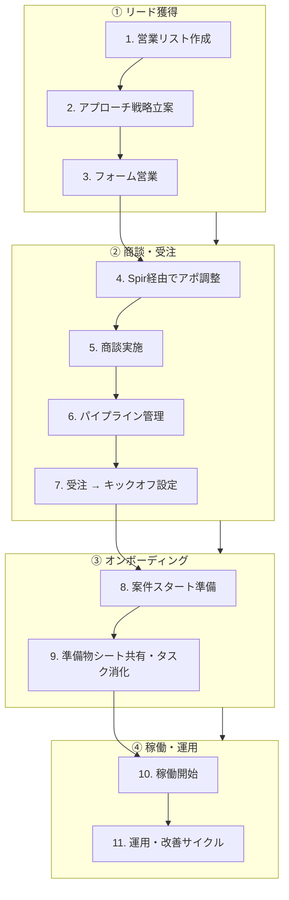

# Sales Automation — 営業〜受注〜稼働の一元管理・自動化

営業リスト作成から受注、そして案件の稼働開始・運用までの**全業務を棚卸し**し、
**一元管理（Single Source of Truth）**と**自動化**を実現するための設計リポジトリです。

## 何を解決するか

現状、営業〜受注〜オンボーディングの各ステップが、スプレッドシート・カレンダー・
メール・チャットなどに散らばっており、以下の課題があります。

- 案件（ディール）の状態が**どこを見れば分かるのか一元化されていない**
- ステップ間の**引き継ぎが手作業**（リスト→アプローチ→商談→受注→稼働準備）
- 受注後の**準備物・タスクの抜け漏れ**が起きやすい
- KPI（架電数・アポ数・受注率・稼働開始までのリードタイム）が**集計に手間**

本リポジトリでは、これらを「1本の案件IDが全工程を貫く」データモデルに整理し、
各ステップで**何を自動化できるか**を具体的なトリガー／アクション単位で定義します。

## 全体像（11ステップ）

## ドキュメント一覧

| ドキュメント | 内容 |
| --- | --- |
| [docs/01_業務フロー棚卸し.md](docs/01_業務フロー棚卸し.md) | 11ステップの棚卸し。各工程の目的・インプット/アウトプット・担当・使用ツール・現状課題 |
| [docs/02_一元管理設計.md](docs/02_一元管理設計.md) | 案件IDを軸にした一元管理の全体設計とデータモデル |
| [docs/03_自動化設計.md](docs/03_自動化設計.md) | 各ステップの自動化候補（トリガー／アクション／使用ツール）と優先度 |
| [docs/04_導入ロードマップ.md](docs/04_導入ロードマップ.md) | フェーズ別の導入計画とKPI |
| [docs/05_RITABO_LP構成案.md](docs/05_RITABO_LP構成案.md) | 営業代行RITABOのLP構成メモ(質問形式ワークシート)。質問に答えるとLPの骨組みができる |

## 一元管理の基本方針

> **1つの案件（ディール）に1つのIDを付与し、リスト→商談→受注→案件→稼働まで
> 同じIDで貫く。** これにより「この会社は今どの工程にいるか」が常に1画面で分かる。

推奨プラットフォームは **Notion（案件DB＝ハブ）＋ Google Workspace（帳票・カレンダー・
メール）＋ Spir（日程調整）** の組み合わせ。詳細は
[docs/02_一元管理設計.md](docs/02_一元管理設計.md) を参照。

## ステータス（このリポジトリの現在地）

- [x] 業務フローの棚卸しドキュメント化
- [x] 一元管理データモデルの設計
- [x] 自動化候補の洗い出し
- [ ] プラットフォームの確定（Notion / Google Sheets / 独自DB）
- [ ] フェーズ1の自動化実装（受注→キックオフ〜準備物シート自動生成）
