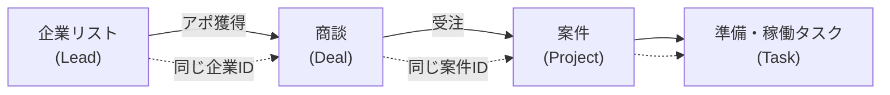
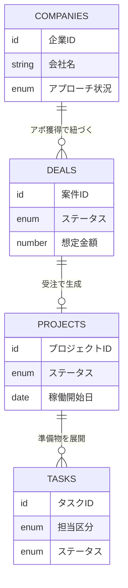

# 02. 一元管理設計

## 基本コンセプト：1本の案件IDで全工程を貫く

営業リストの1社が、アプローチ → 商談 → 受注 → 案件 → 稼働まで進むあいだ、
**同じ識別子（企業ID／案件ID）で追跡できる**ことが一元管理の核心。

「今この会社はどの工程にいるか」「受注までのリードタイムは」「準備物は揃ったか」を、
レポートやシートを渡り歩かずに**1画面で**確認できる状態を目指す。

---

## 推奨プラットフォーム構成

| レイヤー | 推奨ツール | 役割 |
| --- | --- | --- |
| **ハブ（一元管理DB）** | **Notion** | 企業／商談／案件／タスクの4DB。全工程の状態はここに集約 |
| 帳票・成果物 | Google Drive / Sheets / Docs | 契約書・スクリプト・管理シート・準備物シートの実体 |
| 日程調整 | Spir | アポ・キックオフの日程調整（既存フローを踏襲） |
| カレンダー | Google Calendar | 確定した商談・MTG。Notionと双方向連携 |
| メール | Gmail | 送信・リマインド・レポート配信 |
| 自動化エンジン | GAS / n8n / Zapier / スクリプト | ツール間の連携・トリガー実行 |

> **なぜNotionをハブにするか**: DB間リレーション（企業↔商談↔案件↔タスク）が容易、
> ステータスのビュー切替（かんばん／テーブル）でパイプライン管理に向く、
> 権限を絞れば先方共有も可能。既に接続済みのため実装着手が早い。
>
> **代替案**:
> - **Google Sheets中心** … 既存資産を活かせるが、リレーションと自動化が弱い
> - **独自DB（Supabase等）＋Webアプリ** … 最も柔軟だが構築・保守コストが高い
>
> まずはNotionでMVPを組み、規模拡大時に独自DBへ移行する二段構えを推奨。

---

## データモデル（4つのコアDB）

### DB-1: 企業リスト（Companies / Leads）
アプローチ対象の企業マスタ。ステップ1〜3を管理。

| フィールド | 型 | 説明 |
| --- | --- | --- |
| 企業ID | 主キー | 一意の識別子 |
| 会社名 | テキスト | |
| URL | URL | |
| 問合せフォームURL | URL | フォーム営業の宛先 |
| 業種 / 規模 / エリア | 選択 | セグメント属性 |
| セグメント | 選択 | 戦略の割当（→DB-2ではなく戦略テンプレ参照） |
| アプローチ状況 | 選択 | 未アプローチ / 送信済 / 返信あり / アポ獲得 / 対象外 |
| 送信日時 / 文面バージョン | 日付/テキスト | ステップ3の送信ログ |
| 商談 | リレーション | → 商談DB |

### DB-2: 商談（Deals / Opportunities）
アポ獲得〜受注/失注を管理。ステップ4〜7。**パイプラインの本体**。

| フィールド | 型 | 説明 |
| --- | --- | --- |
| 案件ID | 主キー | |
| 案件名 | テキスト | |
| 企業 | リレーション | → 企業DB |
| ステータス | 選択 | リード / 初回商談 / 提案 / 検討 / **受注** / 失注 |
| 確度 | 選択 | A / B / C |
| 想定金額 | 数値 | |
| 商談日 | 日付 | Spir/カレンダー由来 |
| Spirリンク / 会議URL | URL | |
| 商談メモ | テキスト | |
| 次アクション / 次アクション日 | テキスト/日付 | 滞留アラートの基準 |
| 担当 | 人 | |
| 案件（プロジェクト） | リレーション | 受注時に → 案件DB |

### DB-3: 案件（Projects）
受注後の稼働準備〜運用を管理。ステップ8〜11。

| フィールド | 型 | 説明 |
| --- | --- | --- |
| プロジェクトID | 主キー | |
| 案件名 / クライアント | テキスト/リレーション | |
| 元商談 | リレーション | → 商談DB |
| ステータス | 選択 | キックオフ前 / 準備中 / 稼働前チェック / **稼働中** / 更新 / 終了 |
| キックオフ日 | 日付 | |
| 契約ステータス | 選択 | 未 / 送付済 / 締結済 |
| ターゲット選定 / スクリプト / 管理シート | URL | Drive成果物へのリンク |
| 準備物シートURL | URL | 先方共有シート（ステップ9） |
| 稼働開始日 | 日付 | |
| 準備タスク | リレーション | → タスクDB |

### DB-4: タスク（Tasks）
準備物・稼働タスクを自社／先方それぞれ管理。ステップ8〜9の実行単位。

| フィールド | 型 | 説明 |
| --- | --- | --- |
| タスクID | 主キー | |
| 案件 | リレーション | → 案件DB |
| タスク名 | テキスト | 例: 契約書締結、スクリプト作成、リスト作成 |
| 担当区分 | 選択 | 自社 / 先方 |
| 担当者 | 人/テキスト | |
| 期限 | 日付 | リマインドの基準 |
| ステータス | 選択 | 未着手 / 進行中 / 完了 |
| テンプレ由来 | チェック | 自動生成タスクか |

---

## リレーション全体図

---

## 一元管理で「1画面」化するビュー例

- **パイプラインボード**（DB-2をかんばん表示）: ステータス列で商談を可視化
- **今週のアクション**（DB-2＋DB-4）: 次アクション日・タスク期限が今週のもの
- **稼働準備ボード**（DB-3）: 受注済み案件の準備進捗
- **KPIダッシュボード**: 送信数 / アポ数 / 受注数 / 稼働リードタイムを集計

次は [03_自動化設計.md](03_自動化設計.md) で、このモデル上で何を自動化するかを定義する。
