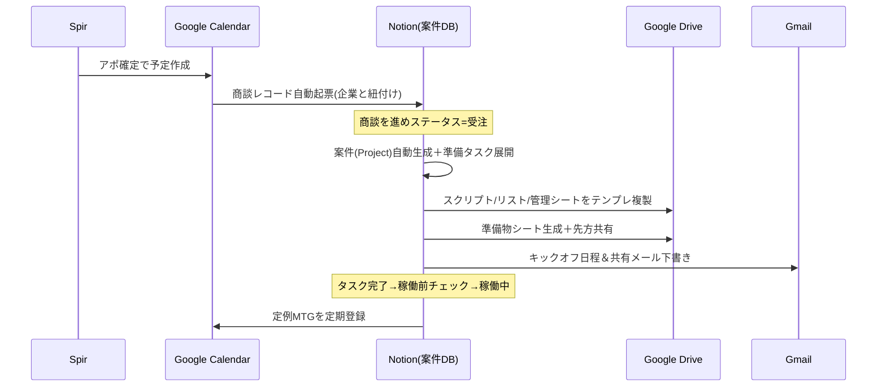

# 03. 自動化設計

各ステップを「**トリガー（きっかけ）→ アクション（自動処理）→ 使用ツール**」の単位で
定義する。人がやるべき判断・対話は残し、**転記・起票・リマインド・生成**を自動化する。

自動化の優先度は以下の観点で `★（高）/ ☆（中）` を付与。
- 手作業の頻度が高い／抜け漏れが致命的 → 高
- 引き継ぎ（工程をまたぐ）の断絶を埋める → 高

---

## ステップ別 自動化カタログ

### 1. 営業リスト作成
| 自動化 | トリガー | アクション | ツール | 優先 |
| --- | --- | --- | --- | --- |
| リスト取込・正規化 | CSV/スクレイプ結果を投入 | 企業DBへ登録、重複排除、表記ゆれ統一 | GAS/スクリプト→Notion | ☆ |
| フォームURL自動抽出 | 企業URL登録時 | サイトから問合せフォームURLを推定・付与 | スクリプト | ☆ |

### 2. アプローチ戦略
| 自動化 | トリガー | アクション | ツール | 優先 |
| --- | --- | --- | --- | --- |
| セグメント自動割当 | 業種・規模の入力 | ルールに基づきセグメント／文面テンプレを割当 | Notion数式/スクリプト | ☆ |

### 3. フォーム営業
| 自動化 | トリガー | アクション | ツール | 優先 |
| --- | --- | --- | --- | --- |
| 送信ログ自動反映 | フォーム送信完了 | 企業DBのアプローチ状況を「送信済」に更新、送信日時・文面Ver記録 | 送信ツール→Notion | ★ |
| 二重送信ガード | 送信前チェック | 直近送信済みを除外リスト化 | スクリプト | ☆ |

### 4. Spir経由アポ調整 ★最重要
| 自動化 | トリガー | アクション | ツール | 優先 |
| --- | --- | --- | --- | --- |
| **商談レコード自動起票** | Spirで日程確定＝カレンダーに予定作成 | 商談DBにレコード生成（企業と紐付け、商談日・会議URL・Spirリンク転記）、アプローチ状況を「アポ獲得」に更新 | Google Calendar監視→Notion | ★ |
| 事前リマインド | 商談24h前 | 担当へ通知＋商談メモテンプレを準備 | Calendar/Gmail | ☆ |

> ここが「アポは取れるが案件として起票されず後追い紐付け」という現状課題の解消点。
> カレンダー予定のタイトル・招待メール・Spirの識別子から企業を突合して自動起票する。

### 5. 商談
| 自動化 | トリガー | アクション | ツール | 優先 |
| --- | --- | --- | --- | --- |
| 商談メモテンプレ生成 | 商談開始 | ヒアリング項目つきメモを自動作成し商談レコードにリンク | Notion/Docs | ☆ |
| （任意）文字起こし要約 | 録画アップ | 要約を商談メモへ | 文字起こしツール | ☆ |

### 6. パイプライン管理
| 自動化 | トリガー | アクション | ツール | 優先 |
| --- | --- | --- | --- | --- |
| 滞留アラート | 次アクション日を過ぎ／N日更新なし | 担当へ通知、ボード上でフラグ | Notion/GAS→Slack/Gmail | ★ |
| 次アクション自動起票 | ステータス変更 | ステータスに応じた次アクション雛形を提示 | Notion | ☆ |

### 7. 受注 → キックオフ設定 ★最重要
| 自動化 | トリガー | アクション | ツール | 優先 |
| --- | --- | --- | --- | --- |
| **案件（Project）自動生成** | 商談ステータス＝「受注」 | 案件DBにレコード生成（商談から金額・クライアント・担当を引継ぎ）、ステータス「キックオフ前」 | Notion自動化/スクリプト | ★ |
| キックオフ日程調整の起動 | 同上 | キックオフ用Spir URL発行 or 候補日をカレンダーから提案しメール下書き | Spir/Calendar/Gmail | ★ |
| 準備タスク一括生成 | 案件生成時 | ステップ8のサブタスク（契約・スクリプト・リスト・管理シート等）をタスクDBへ自動展開 | Notion/スクリプト | ★ |

### 8. 案件スタート準備 ★
| 自動化 | トリガー | アクション | ツール | 優先 |
| --- | --- | --- | --- | --- |
| **成果物テンプレ一式の自動複製** | 案件生成時 | スクリプト／営業リスト／商談管理シートのテンプレをDriveに複製し案件フォルダを作成、リンクを案件DBに記録 | Google Drive/Sheets | ★ |
| 契約書ドラフト準備 | 案件生成時 | 契約書テンプレを複製し先方情報を差込 | Docs/Drive | ☆ |

### 9. 準備物シート共有・タスク消化 ★
| 自動化 | トリガー | アクション | ツール | 優先 |
| --- | --- | --- | --- | --- |
| **準備物シート自動生成・共有** | 準備タスク確定 | 準備物チェックリストのシートを生成し先方に共有権限付与、共有メール下書き | Sheets/Drive/Gmail | ★ |
| タスクリマインド | 期限接近／超過 | 自社・先方の未完了タスクを担当へリマインド | Gmail/Notion | ★ |
| 準備完了判定 | 全タスク完了 | 案件ステータスを「稼働前チェック」へ更新、稼働開始日設定を促す | Notion | ☆ |

### 10. 稼働開始
| 自動化 | トリガー | アクション | ツール | 優先 |
| --- | --- | --- | --- | --- |
| 稼働体制の自動立ち上げ | 稼働開始日到達／ステータス「稼働中」 | 定例MTGをカレンダーに定期登録、KPIダッシュボード初期化 | Calendar/Notion | ☆ |

### 11. 運用・改善サイクル
| 自動化 | トリガー | アクション | ツール | 優先 |
| --- | --- | --- | --- | --- |
| KPI自動集計 | 日次/週次 | 架電・アポ・商談・受注数を集計しダッシュボード更新 | GAS/Notion | ☆ |
| 定期レポート生成 | 週次/月次 | 先方共有レポートを自動生成しメール下書き | Sheets/Docs/Gmail | ☆ |
| 更新・アップセル提案 | 契約更新前N日 | 更新案件をリストアップし担当に通知 | Notion/Gmail | ☆ |

---

## 全体の自動化フロー（受注以降のコア）

---

## 「まず何から自動化するか」（推奨初手）

**最も効く2点は工程またぎの引き継ぎ自動化**:

1. **④ アポ→商談レコード自動起票**（現状の後追い紐付けを撲滅）
2. **⑦⑧⑨ 受注→案件生成→準備物テンプレ複製・共有**（毎回ゼロから作る負荷と抜け漏れを撲滅）

この2点を先に組むだけで、散らばりと手戻りの大半が消える。
実装順の詳細は [04_導入ロードマップ.md](04_導入ロードマップ.md) を参照。
