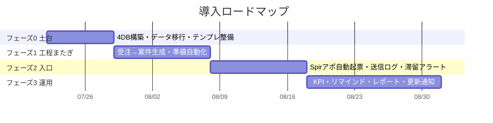

# 04. 導入ロードマップ

「一気に全部」ではなく、**効果が大きく引き継ぎの断絶を埋める箇所から**段階導入する。

---

## フェーズ0: 土台づくり（1週目）
- Notionに4つのDB（企業／商談／案件／タスク）を作成し、リレーションを設定
- 既存スプレッドシートの営業リスト・パイプラインをNotionへ移行
- ステータスの定義を統一（本ドキュメントの選択肢に揃える）
- 成果物テンプレ（スクリプト／営業リスト／商談管理シート／準備物シート／契約書）を
  Google Driveの「テンプレ」フォルダに整備

**ゴール**: すべての案件がNotionの1画面で見られる（自動化はまだ手動運用）。

## フェーズ1: 工程またぎの自動化（2〜3週目）← 最優先
1. **受注→案件自動生成＋準備タスク一括展開**（ステップ7〜8）
2. **準備物テンプレのDrive自動複製＋準備物シート先方共有**（ステップ8〜9）
3. **キックオフ日程調整＋共有メール下書き**（ステップ7・9）

**ゴール**: 「受注」を押すと、案件・タスク・成果物フォルダ・準備物シート・
キックオフ調整までが自動で立ち上がる。

## フェーズ2: 入口の自動化（4〜5週目）
1. **Spirアポ→商談レコード自動起票**（ステップ4）
2. フォーム送信ログの自動反映（ステップ3）
3. パイプライン滞留アラート（ステップ6）

**ゴール**: アポが取れたら自動で案件化。送信状況もリストに自動反映。

## フェーズ3: 運用・可視化（6週目〜）
1. KPI自動集計ダッシュボード（送信/アポ/商談/受注/リードタイム）
2. タスクリマインド（自社・先方）
3. 定期レポート自動生成
4. 更新・アップセル通知

**ゴール**: 数字が自動で集まり、改善と継続提案が回る。

---

## ロードマップ図

---

## KPI（この仕組みで測るもの）

| 指標 | 定義 | 見る工程 |
| --- | --- | --- |
| 送信数 | フォーム営業の送信件数 | 3 |
| アポ獲得数 / 率 | 送信→アポ | 3→4 |
| 商談数 | 実施した商談 | 5 |
| 受注数 / 受注率 | 商談→受注 | 6→7 |
| 稼働リードタイム | 受注→稼働開始までの日数 | 7→10 |
| 準備タスク完了率 | 期限内完了の割合 | 8→9 |
| 継続 / 更新率 | 契約更新・追加受注 | 11 |

---

## 意思決定が必要なポイント（要確認）

導入前に決めておきたい論点。回答があれば設計を確定できる。

1. **一元管理のプラットフォーム**: Notion中心で進めてよいか
   （代替: Google Sheets中心 / 独自DB）
2. **既存ツール**: 現在パイプライン管理に使っているツール（スプレッドシート／
   特定のCRM）は何か。移行 or 併用か
3. **フォーム営業の送信手段**: 手動か、特定の送信ツールか（自動連携の可否に影響）
4. **Spirの連携範囲**: Spirはカレンダー連携のみか、Webhook等の連携が可能か
5. **チャット通知先**: アラート・リマインドの通知先（Slack / メール / Notion）
6. **先方共有の形式**: 準備物シートはGoogleスプレッドシート共有でよいか

上記が固まり次第、フェーズ1（受注→案件生成〜準備物自動化）から実装に着手する。
